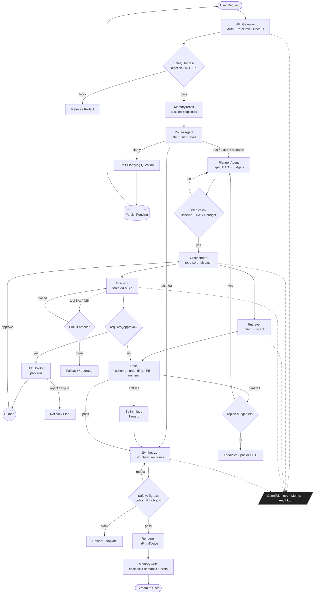

# Multi-Agent AI System: Enterprise Knowledge & Action Assistant

> Production-grade reference architecture for a multi-agent system that answers questions, retrieves enterprise knowledge, and executes actions across SaaS systems for millions of users.

---

## 1. Executive Summary

**Goal.** Build a horizontally-scalable, multi-agent assistant that (a) understands ambiguous user intents, (b) retrieves grounded context from heterogeneous enterprise data (docs, tickets, CRM, code, analytics), (c) plans and executes multi-step actions through tools, and (d) returns validated, cited responses under strict latency, cost, and safety budgets.

**Core design principles.**

| Principle | Implementation |
|---|---|
| **Separation of cognition and execution** | Planner agents never call mutating tools; Executor agents never plan. |
| **Type-safe contracts between agents** | All inter-agent messages are Pydantic/Zod-validated JSON envelopes with versioned schemas. |
| **Cost & latency tiering** | Router classifies query complexity → cheapest viable model. ~70% of traffic served by Haiku-tier; only escalations hit Opus-tier. |
| **Determinism where possible, LLMs where necessary** | Routing, validation, retries, and circuit-breaking are deterministic code; only reasoning-heavy steps use LLMs. |
| **Observability first** | Every agent step emits OpenTelemetry traces with token, cost, latency, and quality signals. |
| **Defense in depth** | Prompt-injection screening at ingress, output validation at egress, sandboxed tool execution, signed action approvals. |

**Headline numbers (target SLOs).** P50 < 1.8s, P95 < 6s for read queries; P95 < 14s for action queries. 99.9% availability. ≤ $0.012/query blended cost at steady state.

---

## 2. High-Level Architecture

### 2.1 Logical layers

```
┌──────────────────────────────────────────────────────────────────────┐
│  Edge / API Gateway      (Auth, rate-limit, prompt-injection scan)   │
├──────────────────────────────────────────────────────────────────────┤
│  Session & State Layer   (Redis sessions, Postgres conversations)    │
├──────────────────────────────────────────────────────────────────────┤
│  Orchestrator            (LangGraph state machine, durable)          │
├──────────────────────────────────────────────────────────────────────┤
│  Agent Mesh                                                          │
│   ├─ Router       ├─ Planner      ├─ Retriever                      │
│   ├─ Executor     ├─ Critic       ├─ Synthesizer                    │
│   └─ Safety       └─ Memory       └─ HITL Broker                    │
├──────────────────────────────────────────────────────────────────────┤
│  Tool Plane              (MCP servers, sandboxed; signed manifests)  │
├──────────────────────────────────────────────────────────────────────┤
│  Memory Plane            (pgvector, Redis, S3, Neo4j entity graph)   │
├──────────────────────────────────────────────────────────────────────┤
│  Model Plane             (Anthropic, Bedrock, vLLM self-hosted)      │
└──────────────────────────────────────────────────────────────────────┘
```

### 2.2 Why a mesh of specialists rather than one big agent

A single ReAct loop becomes unstable past ~12 turns: tool errors compound, context window bloats, and the model conflates planning with execution. Splitting concerns produces:

- **Bounded context per agent** → smaller prompts, lower hallucination rate, predictable cost.
- **Independent scaling** — Retriever traffic ≫ Planner traffic; we can scale them separately.
- **Targeted evals** — each agent has its own eval harness and deploy cadence.
- **Failure isolation** — a flaky tool only takes down the Executor's circuit, not the conversation.

---

## 3. Agent-by-Agent Breakdown

### 3.1 Roster

| Agent | Purpose | Model tier | Latency budget | Statefulness |
|---|---|---|---|---|
| **Router** | Classify query, pick policy | Haiku-class | 150 ms | Stateless |
| **Planner** | Decompose into a typed DAG of steps | Sonnet-class | 1.5 s | Stateless (state in Orchestrator) |
| **Retriever** | Hybrid search across corpora | Embedding + Haiku rerank | 600 ms | Stateless, caches |
| **Executor** | Call tools, handle errors | Sonnet-class | 2 s/tool | Per-task scratchpad |
| **Critic** | Validate intermediate outputs | Haiku-class | 400 ms | Stateless |
| **Synthesizer** | Compose final answer with citations | Sonnet-class (Opus on escalate) | 2 s | Stateless |
| **Safety** | Policy/PII/jailbreak checks at ingress & egress | Small classifier + Haiku fallback | 80 ms | Stateless |
| **Memory** | Read/write episodic + semantic memory | Deterministic + Haiku summarizer | 200 ms | Stateful (DBs) |
| **HITL Broker** | Route approvals to humans | Deterministic | n/a | Stateful |

Below, full spec for each agent.

---

### 3.2 Router Agent

**Purpose.** Single entry point after Safety. Classifies query into one of {`fast_qa`, `rag`, `action`, `research`, `clarify`} and emits a routing decision with a confidence score. Picks the cheapest viable plan.

**System prompt (excerpt).**
```
You are a deterministic routing classifier. Output ONLY valid JSON matching
the RouterDecision schema. Pick the LOWEST tier that can answer correctly.
Escalate to `research` only if the query requires multi-source synthesis or
contains hedging language ("compare", "analyze", "why"). Never answer the
user; you only route. If intent is ambiguous, emit `clarify` with a single
question.
```

**Input schema.**
```json
{
  "user_id": "uuid",
  "session_id": "uuid",
  "query": "string",
  "history_summary": "string (≤ 400 tokens)",
  "user_context": { "role": "string", "tenant_id": "uuid", "locale": "string" }
}
```

**Output schema.**
```json
{
  "intent": "fast_qa | rag | action | research | clarify",
  "confidence": "float 0..1",
  "model_tier": "haiku | sonnet | opus",
  "tools_required": ["string"],
  "estimated_steps": "int",
  "reason": "string (≤ 80 tokens, for logging)"
}
```

**Decision logic.** `confidence < 0.6` → fall back to `rag` (the safe default). `intent=action` AND `tools_required` overlaps `MUTATING_TOOLS` → force HITL flag.

**Failure modes & recovery.** Schema-invalid output → 1 retry with stricter prompt + JSON-mode → fallback to `rag`. Timeout > 400 ms → assume `rag`.

**Context window.** ≤ 1k tokens (query + thin history summary).

**Cost lever.** Prompt-cached system prompt; ~$0.0002/call.

---

### 3.3 Planner Agent

**Purpose.** Convert a routed query into a **typed DAG** of steps. Each node declares inputs, outputs, and the agent that should execute it. The Planner does not call tools; it produces a plan that the Orchestrator executes.

**System prompt (excerpt).**
```
You are a planner. You produce DAGs, not prose. Maximize parallelism: any two
steps without a data dependency MUST be siblings, not sequential. Never plan
mutating tools without an explicit `requires_approval: true` flag. Plans are
capped at 12 nodes; if the task is larger, emit a `decompose` step that re-
invokes the planner on a sub-goal.
```

**Output schema.**
```json
{
  "plan_id": "uuid",
  "nodes": [
    {
      "id": "string",
      "agent": "retriever | executor | synthesizer | planner",
      "depends_on": ["string"],
      "input_template": "object",
      "expected_output_schema": "json-schema",
      "max_retries": "int",
      "timeout_ms": "int",
      "requires_approval": "bool"
    }
  ],
  "rollback_plan": ["string"],
  "budget": { "max_tokens": "int", "max_usd": "float" }
}
```

**Decision logic.** Cycles forbidden — validated by topological sort before commit. If a step's `expected_output_schema` is incompatible with the next step's input, the planner is re-invoked with the validation error attached (max 2 re-plans).

**Recovery.** On execution failure, the Critic emits a `replan_hint`; the Orchestrator calls Planner with the hint + remaining budget.

---

### 3.4 Retriever Agent

**Purpose.** Hybrid retrieval across corpora (docs, tickets, code, CRM notes), deduplication, reranking, and citation packaging.

**Pipeline (deterministic, not LLM until rerank).**
1. **Query rewrite** — Haiku-class LLM expands acronyms, generates 3 paraphrases (HyDE-style for low-recall queries only, gated by Router).
2. **Parallel fan-out** — vector search (pgvector, cosine, top-50), BM25 (Elastic, top-50), entity graph walk (Neo4j, top-20 by entity match).
3. **Reciprocal Rank Fusion** with corpus-weighted priors.
4. **Cross-encoder rerank** (BGE-reranker-v2-m3 on GPU) → top-8.
5. **Citation packaging** — each chunk carries `{source_id, url, span, ts, ACL_tag}`.

**Critical detail: tenancy.** Every retrieval is filtered by `tenant_id` and `acl_principal_set` **at the index level**, not post-filter. This is a hard correctness boundary.

**Caching.** Two layers:
- **Query-level**: hash of `(tenant_id, normalized_query, freshness_bucket)` → results, TTL 5 min, S/W/R semantics.
- **Embedding-level**: hash of normalized text → vector, TTL 30 days.

**Failure modes.** Index unavailable → degrade to BM25-only with banner in response. Reranker GPU starvation → skip rerank, return RRF top-8 with confidence penalty.

---

### 3.5 Executor Agent

**Purpose.** Call tools (read or write) per the plan. The only agent allowed to invoke mutating tools.

**Tool plane.** Tools exposed via **MCP servers**, each running in its own sandbox (gVisor or Firecracker microVM for untrusted tools; container for trusted ones). Each tool ships a signed manifest declaring:
- input/output schema
- side-effect class (`read | write | external_send`)
- idempotency key support
- cost & rate limits
- required scopes

**System prompt (excerpt).**
```
You execute one step at a time. Never reason about the overall goal; trust
the plan. If a tool call fails with a retryable error (5xx, 429, timeout),
retry with exponential backoff using the supplied idempotency key. If non-
retryable (4xx other than 429), emit a structured failure and STOP — do not
improvise an alternative tool.
```

**Decision logic.**
- **Idempotency.** Every mutating call receives `idempotency_key = hash(plan_id, node_id, attempt_round)`.
- **Approval gate.** `requires_approval=true` → emit `await_human_approval` event; Orchestrator parks the run in a durable queue.
- **Parallel tool calling.** Independent reads dispatched concurrently via `asyncio.gather` with per-tool semaphores.

**Recovery.** Three retry classes with distinct backoff curves: rate-limited (token-bucket-aware), transient (exponential + jitter), structural (no retry, escalate to Critic).

---

### 3.6 Critic Agent

**Purpose.** Validate intermediate outputs **before** they propagate. Cheap, fast, ruthless.

**Checks (each emits a signal, not a hard fail unless marked).**
| Check | Method | Hard fail? |
|---|---|---|
| Schema validity | JSON-schema | Yes |
| Citation grounding | Each claim must map to a retrieved span (token-level overlap + entailment via small NLI model) | Yes for `rag` and `research` |
| Numeric consistency | Re-derive cited numbers from source | Soft |
| Tool-result sanity | Range/type heuristics per tool | Soft |
| PII leakage | Microsoft Presidio + custom regex | Yes |
| Self-contradiction | NLI between answer and history | Soft |

**Self-critique loop.** When Critic flags a soft issue, the Synthesizer is re-invoked with the critique appended (max 1 round; 2nd round only on Opus escalation). Hard fails trigger replan.

---

### 3.7 Synthesizer Agent

**Purpose.** Compose the final user-facing response with inline citations, structured fields, and follow-up suggestions.

**Notable design choice: structured-first generation.** Synthesizer outputs a **structured response object** (sections, citations, actions taken, confidence). A separate deterministic renderer turns it into Markdown/HTML/voice. This avoids re-prompting for every channel.

**Output schema (abridged).**
```json
{
  "answer_blocks": [{ "type": "paragraph|table|code|action_summary", "content": "...", "citations": ["c1","c2"] }],
  "citations": [{ "id": "c1", "source": "...", "url": "...", "span": "..." }],
  "confidence": "float",
  "uncertainty_notes": ["string"],
  "suggested_followups": ["string"]
}
```

---

### 3.8 Safety Agent

**Two-stage, two-direction.**

| Stage | Check | Implementation |
|---|---|---|
| Ingress | Prompt injection (instruction-override, role-confusion, exfil patterns) | Small classifier (~50ms) + Haiku confirmer on uncertain |
| Ingress | Tenant-scope policy (e.g., "user from tenant A asking about tenant B") | Deterministic ACL check |
| Egress | PII / secrets / NSFW | Presidio + regex + classifier |
| Egress | Policy compliance (legal, brand, jurisdiction) | Rule engine with prompt-caching |

Failures route to a **redaction** path (rewrite) or a **block** path (refusal template), never silently dropped.

---

### 3.9 Memory Agent

See §5.

---

### 3.10 HITL Broker

**Purpose.** When approval is required (mutating action, low confidence above $X impact, or policy escalation), park the run and notify the appropriate human via Slack/email/in-product.

**State machine.** `pending → approved → resumed`, `pending → rejected → rolled_back`, `pending → expired (24h) → rolled_back`. Run state is durable in Postgres via the Orchestrator's checkpointer.

---

## 4. Orchestration Logic

### 4.1 Engine

We use **LangGraph** (or equivalent: Temporal + a thin LLM-step library) for orchestration because we need:
- Durable state (a run can pause for hours awaiting HITL)
- Native parallel branches
- Streaming tokens out of nodes
- Per-node retries and timeouts encoded as graph metadata

### 4.2 Lifecycle of a request

```
1. Ingress → API gateway authenticates, rate-limits, attaches trace ID.
2. Safety.ingress → block | redact | pass.
3. Memory.recall → load session summary, relevant episodic, user prefs.
4. Router → emits RouterDecision.
5. If clarify → return question, persist pending state.
6. Planner → emits typed DAG. Orchestrator validates, assigns budgets.
7. Execute DAG:
     - Topo-sort, dispatch ready nodes.
     - Per node: run agent in subprocess/coroutine with timeout + retry policy.
     - On tool need: Executor → MCP → sandbox.
     - On approval need: park run in durable queue, return ack.
     - Stream partials to client over SSE/WebSocket.
8. Critic gates each output.
9. Synthesizer composes final structured response.
10. Safety.egress → finalize.
11. Memory.write → episodic + semantic updates.
12. Telemetry flush.
```

### 4.3 Concurrency, retries, priority

| Concern | Mechanism |
|---|---|
| Parallel reads | `asyncio.gather` with bounded semaphore per backend |
| Retry policy | Per-node: `RetryPolicy(max=3, backoff=expo(2s,30s,jitter), retry_on=[Transient, RateLimit])` |
| Priority | Two queues — `interactive` (P95 SLO) and `batch` (best-effort) — with separate worker pools |
| Backpressure | Token-bucket per tenant; degrade Router to direct-RAG mode under overload |
| State | LangGraph checkpointer → Postgres; resumable from any node |

---

## 5. Memory System

### 5.1 Three tiers

| Tier | Storage | Lifetime | Contents | Read path |
|---|---|---|---|---|
| **Working** | In-process / Redis | seconds–minutes | current plan, scratchpad, tool results | direct |
| **Session** | Redis + Postgres | hours–days | running summary (compressed every N turns), entity slots, user prefs | structured load |
| **Long-term** | pgvector + Postgres + Neo4j | persistent | episodic events, distilled facts, entity graph | retrieval |

### 5.2 Compression strategy

- After every 6 turns (or 6k tokens), a small model compresses the oldest segment into ≤ 400 tokens of structured summary: `{user_goals, decisions_made, open_questions, entities, do_not_repeat}`.
- The latest 2 turns are always kept verbatim (recency anchor).
- Summaries are stored both as text (for prompt insertion) and as embeddings (for cross-session recall).

### 5.3 Long-term memory write policy

Not everything is worth remembering. A tiny classifier (~100ms) decides: `{forget, fact, preference, episodic}`.
- `fact` → vector store with provenance and a TTL based on volatility.
- `preference` → key-value store, deterministic recall.
- `episodic` → vector store, summarized.
- `forget` → discarded.

This prevents memory rot — the dominant failure mode of naive "store everything" designs.

### 5.4 Retrieval strategy for memory

Hybrid (same as §3.4) but with two extras: **time decay** (exponential, half-life tunable per memory type) and **explicit pinning** (user can pin a fact; bypasses ranking).

### 5.5 Multi-agent shared memory

Agents do not share a mutable working memory. Instead, the Orchestrator owns the run state; each agent receives a curated, **read-only slice** of it as input. This is the single most important rule for keeping multi-agent systems debuggable. Mutations happen only via typed events the Orchestrator applies.

---

## 6. Validation System

### 6.1 Layered defense

```
Schema → Grounding → Self-critique → Policy → Consistency
 (hard)   (hard for RAG)   (soft, 1 round)   (hard)   (soft)
```

### 6.2 Confidence scoring

A composite score per response:
```
conf = w1 * citation_coverage     # fraction of claims with grounded citation
     + w2 * critic_pass_rate       # fraction of soft checks passed
     + w3 * planner_replans_inv    # 1 / (1 + replans)
     + w4 * tool_success_rate
     + w5 * model_logprob_signal   # if exposed
```
Tuned offline against human-labeled correctness. Below threshold → escalate to Opus or HITL, depending on policy.

### 6.3 Hallucination reduction stack

1. Retrieve-then-generate, never generate-then-retrieve.
2. Citation grounding with NLI entailment, not just lexical overlap.
3. Constrained decoding for structured fields (JSON-mode, tool schemas).
4. Numeric sanity re-derivation by Critic.
5. "Don't know" is a first-class output — Synthesizer is rewarded in evals for it.

---

## 7. Reliability & Scalability

### 7.1 Reliability patterns

| Pattern | Where |
|---|---|
| **Timeouts** | Every LLM/tool call; hierarchical (node ≤ plan ≤ request) |
| **Circuit breakers** | Per (tool, tenant); half-open probes |
| **Bulkheads** | Separate worker pools per agent type; one bad agent can't starve others |
| **Fallback chains** | Sonnet → Sonnet via Bedrock → self-hosted Llama for read paths; never for action paths |
| **Idempotency** | All mutating tool calls; orchestrator dedupes by request key |
| **Dead-letter** | Failed runs to DLQ with full state for replay |
| **Chaos drills** | Game-day: kill retriever, kill a model provider, exhaust rate limits |

### 7.2 Observability

- **Tracing**: OpenTelemetry; every agent step is a span with `tokens_in/out`, `usd`, `model`, `cache_hit`, `retries`.
- **Metrics**: Prometheus — RED per agent, plus token-cost gauges, queue depths, breaker states.
- **Logs**: Structured JSON, correlation by `trace_id`/`run_id`/`tenant_id`. PII-scrubbed before persistence.
- **LLM evals**: Continuous; sample 1% of prod traffic into an offline eval pipeline (LangSmith/Braintrust). Block deploys on regression.
- **Health**: Synthetic probe runs every 60s per region.

### 7.3 Scalability

| Axis | Mechanism |
|---|---|
| Horizontal | Stateless agent workers behind autoscaler; HPA on queue depth + p95 latency |
| Concurrent users | Async I/O end-to-end; one process handles ~500 in-flight runs |
| Distributed workers | Queue-based dispatch (NATS/SQS); Orchestrator nodes run anywhere |
| GPU | Reranker + embedding models on a dedicated GPU pool with Triton; LLMs via API |
| Caching | Prompt cache (Anthropic), embedding cache, retrieval cache, response cache for FAQ-class queries |
| Async | Long-running plans stream partial results; HITL parks in durable queue |
| Load balancing | Region-affinity for tenant data residency; weighted round-robin across providers per model tier |

### 7.4 Optimization

| Lever | Impact |
|---|---|
| Prompt caching of system prompts + tool defs | 60–80% cost reduction on cached prefixes |
| Dynamic model routing (Router decides tier) | ~3× cost saving vs. always-Opus |
| Speculative execution of likely-needed retrievals during Planner | ~300ms latency saving on common paths |
| Streaming Synthesizer tokens | TTFB < 500ms regardless of total length |
| Parallel tool calling | Multi-tool plans complete in `max(t_i)` not `sum(t_i)` |
| Batched embeddings on the indexer | 5–10× throughput |
| Compiled/quantized rerankers (FP8) on GPU | 2× throughput |

---

## 8. Security Design

| Layer | Control |
|---|---|
| **AuthN** | OIDC at gateway; short-lived JWTs; mTLS between services |
| **AuthZ** | ABAC via OPA; ACLs flow through to retrieval indexes (`acl_principal_set` in every doc) |
| **Tenant isolation** | Row-level security in Postgres; per-tenant index namespaces; per-tenant rate limits |
| **Prompt-injection defense** | Ingress classifier; tool-result sanitization (strip imperatives from retrieved docs before they enter the model); structural separation (system vs. user vs. tool roles never blurred) |
| **Tool sandboxing** | gVisor/Firecracker; egress allowlist per tool; CPU/memory caps |
| **Secrets** | Vault; tools receive scoped tokens at invocation, never persisted in prompts |
| **Action signing** | Mutating actions require signed approval (HITL or policy-engine token); Executor verifies |
| **Audit** | Append-only log of every (user, query, plan, tool call, output, citations) — WORM storage 7y |
| **Data privacy** | PII detection and tokenization at ingress for storage; per-tenant KMS keys; right-to-erasure runbooks |
| **Compliance** | SOC2/ISO27001/HIPAA-capable: data residency routing, BAAs with model providers, opt-out from training |

---

## 9. Tech Stack Recommendations

| Concern | Choice | Why |
|---|---|---|
| Orchestration | **LangGraph** + Temporal for durability | Native graph + checkpointing |
| Model API | **Anthropic** (primary), **AWS Bedrock** (failover), **vLLM** self-hosted (fallback read-only) | Multi-provider for resilience |
| Embeddings | Voyage-3 / Cohere v3 / E5-mistral on vLLM | Cost vs. quality knob |
| Vector DB | **pgvector** (Postgres 16) for ≤ 100M chunks; **Qdrant**/**Vespa** beyond | Operational simplicity first |
| Lexical | **OpenSearch** | Hybrid retrieval |
| Graph | **Neo4j** or **Memgraph** | Entity-centric recall |
| Cache & sessions | **Redis** (cluster) | Standard |
| Queue | **NATS JetStream** or **SQS** | Durable, simple |
| Tool plane | **MCP** servers in **Firecracker** microVMs | Standardized, sandboxed |
| Observability | **OpenTelemetry** → **Tempo / Prometheus / Loki**; LLM evals on **Braintrust** or **LangSmith** | Open standards |
| Policy | **OPA** + **Cedar** | Externalized authz |
| Deployment | **Kubernetes** (EKS), **Karpenter** autoscaling, **Istio** mesh | Industry standard |
| Cloud | Multi-region active-active for read; active-passive for write | Cost vs. RTO tradeoff |
| CI/CD | GitHub Actions + ArgoCD; canary by tenant cohort; eval gate | Safe rollouts |

---

## 10. Mermaid Flowchart



---

## 11. End-to-End Execution Walkthrough

**User query.** *"Summarize last quarter's churn drivers from our CRM and ticket data, and open a Jira to investigate the top one."*

| Step | Agent | Action | Notable detail |
|---|---|---|---|
| 1 | Gateway | Auth + trace ID `tr_abc123` | mTLS to Safety |
| 2 | Safety.ingress | Pass — no injection signature | 42 ms |
| 3 | Memory.recall | Loads session summary: user is VP CS, tenant `acme`, prefers tables | 80 ms |
| 4 | Router | `intent=research`, `tier=sonnet`, `tools=[crm.search, tickets.search, jira.create]`, mutating → approval flag | 130 ms |
| 5 | Planner | DAG: `[A: retrieve_crm_churn, B: retrieve_ticket_themes] → C: synth_drivers → D: jira.create (approval=true)` | A and B parallel |
| 6 | Orchestrator | Dispatches A and B concurrently | |
| 7 | Retriever (A) | Hybrid over CRM corpus, tenant=acme, ACL=VP-CS; top-8 with citations | 540 ms |
| 8 | Retriever (B) | Hybrid over tickets, BM25-heavy because ticket text is short | 480 ms |
| 9 | Critic | Validates schema + grounding for A and B | 110 ms each |
| 10 | Synthesizer (C) | Produces structured churn driver list + table; 6 citations | streamed |
| 11 | Critic | Citation grounding via NLI: 5/6 entailed; 1 soft-fail → self-critique → fixed | 1 extra round |
| 12 | Executor (D) | `requires_approval=true` → HITL Broker posts to Slack `#cs-leadership` with diff: "Create Jira ENG-?, title=…, assignee=…" | run parked |
| 13 | Human | Approves in Slack 4 minutes later | webhook resumes run |
| 14 | Executor (D) | Calls `jira.create` with idempotency key; receives `ENG-4821` | 380 ms |
| 15 | Critic | Verifies returned ticket URL matches expected schema | 50 ms |
| 16 | Synthesizer | Final answer: drivers table + "Created ENG-4821 ✅" + citations + confidence 0.86 | |
| 17 | Safety.egress | Pass | 30 ms |
| 18 | Memory.write | Stores: episodic ("investigated churn Q3"), preference ("uses tables"), fact ("top driver = onboarding friction") with TTL | |
| 19 | Telemetry | Run cost: $0.041, tokens 14.2k in / 1.1k out, cache hit 71%, p95-class | |

**What this run exercises.** Parallel retrieval, typed DAG, HITL with durable parking, idempotent mutating call, citation-grounded synthesis with one self-critique round, structured memory writes, and full tracing.

---

## 12. Production Deployment Recommendations

### 12.1 Environments and rollouts

- **Envs**: `dev` → `staging` (replays 1% sampled prod traffic in shadow) → `prod`.
- **Deploy unit**: each agent is its own service; can deploy independently.
- **Rollout**: ArgoCD canary by tenant cohort (5% → 25% → 100%), gated on:
  - Eval suite pass (regression < 1% on golden set)
  - p95 latency within budget
  - Cost-per-query within ±10%
  - No new error classes in last 30 min

### 12.2 Capacity planning (rule of thumb)

| Component | Sizing heuristic |
|---|---|
| Orchestrator workers | 1 vCPU per 200 concurrent runs (async I/O) |
| Retriever | 1 vCPU per 50 QPS lexical; GPU rerank: 1 L4 per 200 QPS |
| pgvector | Shard at ~50M chunks; pre-warm HNSW |
| Redis | 2× peak working-set; cluster mode |
| LLM concurrency | Buy headroom = 1.5 × p99 concurrent tokens; negotiate multi-provider quota |

### 12.3 Day-2 ops

- **Eval CI**: golden set of 500 queries per intent class; nightly regression; PRs blocked on regression.
- **Drift monitors**: input distribution shift (KS test on embeddings of incoming queries) and output quality drift (online judge model on 1% sample).
- **Cost guardrails**: per-tenant daily budget; alert at 80%, throttle at 100%.
- **Runbooks**: model-provider outage, tool-plane outage, retrieval-corpus poisoning, prompt-injection incident, PII leak.
- **Red team cadence**: monthly adversarial prompts; quarterly external pentest of tool sandboxes.
- **Game days**: quarterly — fail one region, exhaust a model quota, kill the reranker, expire HITL approvals en masse.

### 12.4 Key engineering tradeoffs we are deliberately making

| Tradeoff | Choice | Rationale |
|---|---|---|
| Speed vs. correctness | Two retries max, then escalate | Bounded latency beats infinite refinement |
| Single big agent vs. mesh | Mesh | Debuggability and per-agent eval matter more than prompt simplicity at this scale |
| Self-host LLMs vs. API | API primary, self-host fallback | Quality & ops cost; self-hosted only for resilience and read-only paths |
| Strict schemas vs. free-form | Strict everywhere between agents | The cost of a malformed inter-agent message in prod dwarfs the cost of one extra retry |
| Memory: store all vs. classify-then-store | Classify | Memory rot is the silent killer of long-running assistants |
| HITL friction vs. autonomy | Approval gate on all mutations above $X impact | One bad autonomous action ruins trust faster than ten approval prompts |

---

*End of architecture document.*
